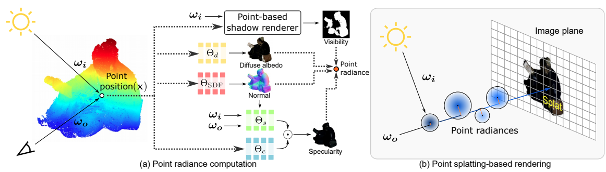
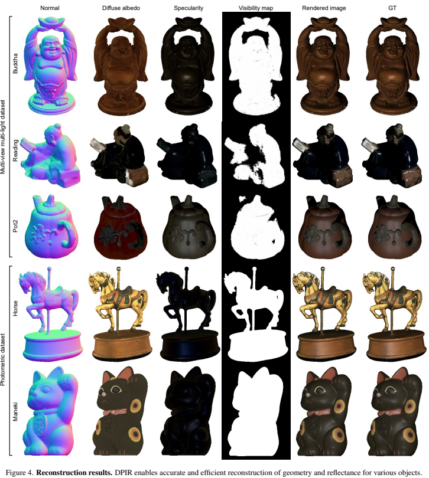

# Differentiable Point-based Inverse Rendering

### [Project](https://hg-chung.github.io/DPIR/) | [Paper](https://arxiv.org/abs/2312.02480)

This repository contains the implementation of the paper:

**Differentiable Point-based Inverse Rendering**

Hoon-Gyu Chung, Seokjun Choi, Seung-Hwan Baek

***CVPR, 2024***

## Abstract
We present differentiable point-based inverse rendering, DPIR, an analysis-by-synthesis method that processes images captured under diverse illuminations to estimate shape and spatially-varying BRDF. To this end, we adopt point-based rendering, eliminating the need for multiple samplings per ray, typical of volumetric rendering, thus significantly enhancing the speed of inverse rendering. To realize this idea, we devise a hybrid point-volumetric representation for geometry and a regularized basis-BRDF representation for reflectance. The hybrid geometric representation enables fast rendering through point-based splatting while retaining the geometric details and stability inherent to SDF-based representations. The regularized basis-BRDF mitigates the ill-posedness of inverse rendering stemming from limited light-view angular samples. We also propose an efficient shadow detection method using point-based shadow map rendering. Our extensive evaluations demonstrate that DPIR outperforms prior works in terms of reconstruction accuracy, computational efficiency, and memory footprint. Furthermore, our explicit point-based representation and rendering enables intuitive geometry and reflectance editing.

<p align="center">
    
</p>

## Installation
We recommend you to use Conda environment. Install pytorch3d following [INSTALL.md](https://github.com/facebookresearch/pytorch3d/blob/main/INSTALL.md).

```bash
conda create -n DPIR python=3.9
conda activate DPIR
conda install pytorch=1.13.0 torchvision pytorch-cuda=11.6 -c pytorch -c nvidia
conda install -c fvcore -c iopath -c conda-forge fvcore iopath
conda install numpy matplotlib tqdm imageio
pip install scikit-image plotly opencv-python pyhocon open3d lpips kornia icecream
conda install pytorch3d -c pytorch3d
```

## Dataset
**We utilized multi-view multi-light image dataset([DiLiGenT-MV Dataset](https://sites.google.com/site/photometricstereodata/mv?authuser=0)) and photometric image dataset.**

Multi-view multi-light image dataset was preprocessed following [PS-NeRF](https://github.com/ywq/psnerf), which contains 5 objects.

Photometric image dataset was rendered by Blender, which contains 4 objects.

You can download dataset from [Google Drive](https://drive.google.com/drive/folders/1mxabFe4BoZozNW6LF_FOT9ZFkgvpJxX6) and put them in the corresponding folder.

## Train and Evaluation
You can train multi-view multi-light dataset(DiLiGenT-MV Dataset) or photometric dataset.

If you want to train and evaluate **DiLiGenT-MV dataset**,
```bash
cd code_diligent
python main.py --conf confs/buddha.conf --datadir DiLiGenT-MV --dataname buddha --basedir output
python evaluation.py --conf confs/buddha.conf --datadir DiLiGenT-MV --dataname buddha --basedir output
```
If you want to train and evaluate **photometric dataset**,
```bash
cd code_photometric
python main.py --conf confs/maneki.conf --datadir Photometric --dataname maneki --basedir output
python evaluation.py --conf confs/maneki.conf --datadir Photometric --dataname maneki --basedir output
```

## Result
<p align="center">
    
</p>


## Citation
If you find this work useful in your research, please consider citing: 
```
@inproceedings{chung2024differentiable,
  title={Differentiable Point-based Inverse Rendering},
  author={Chung, Hoon-Gyu and Choi, Seokjun and Baek, Seung-Hwan},
  booktitle = {Proceedings of the IEEE/CVF Conference on Computer Vision and Pattern Recognition (CVPR)},
  year={2024}
}
```
## Acknowledgement
Part of our code is based on the previous works: [point-radiance](https://github.com/sjtuzq/point-radiance), [PS-NeRF](https://github.com/ywq/psnerf), and [PhySG](https://github.com/Kai-46/PhySG).
